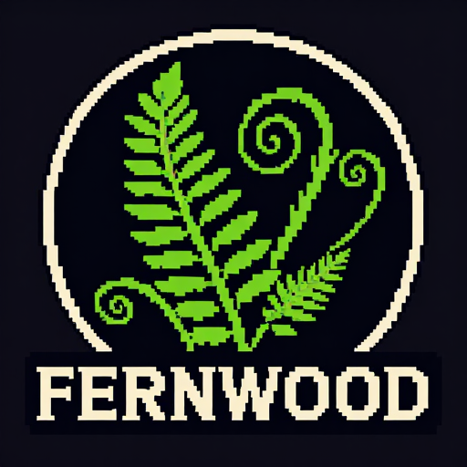

  

<h1 align="center">Fernwood 🌲</h1>

  <strong>A focused coding agent for your terminal.</strong> 
  Local-first · Single binary · Persistent memory via <a href="https://github.com/jayminwest/mulch">Mulch</a>

  
  
  

---

Fernwood is a lightweight agentic coding harness forked from [PicoClaw](https://github.com/sipeed/picoclaw). README coming soon.
