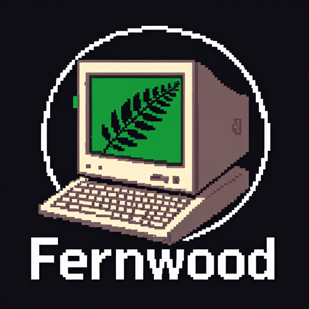

<p align="center">
  
</p>

<h1 align="center">Fernwood 🌲</h1>

<p align="center">
  <strong>A focused coding agent for your terminal.</strong><br/>
  Local-first. Single binary. Always learning via <a href="https://github.com/jayminwest/mulch">Mulch</a>.
</p>

<p align="center">
  <a href="https://golang.org/dl/"></a>
  <a href="LICENSE"></a>
  
</p>

---
"The creativity is in the constraint design, not the output generation." -- Fernwood. 

Fernwood is a lightweight agentic coding harness forked from [PicoClaw](https://github.com/sipeed/picoclaw). 
It focuses on local software development workflows and provides a small set of core tools along with persistent memory across sessions.

**What's different from PicoClaw:**
- Coding-focused toolset (`read_file`, `write_file`, `edit_file`, `bash`)
- Agent identity and system prompt rewritten for software development
- [Mulch](https://github.com/jayminwest/mulch) integration — proactive knowledge recording with session-end reflection
- Dependencies halved (~53 vs ~106 direct deps)
- **Always Be Learning**: Agent-driven expertise accumulation, not noisy auto-recording

**What's inherited from PicoClaw:**
- Single self-contained Go binary
- Fast startup, low memory footprint
- Solid tool loop and agent orchestration
- Chat apps

---

## Quick Start

**1. Build**

```bash
git clone https://github.com/strand1/fernwood.git
cd fernwood
make build
```

**2. Initialize**

```bash
./build/fernwood onboard
```

This creates `~/.fernwood/config.json` and the workspace at `~/.fernwood/workspace`.

**3. Configure**

Edit `~/.fernwood/config.json` and set your API key:

```json
{
  "agents": {
    "defaults": {
      "workspace": "~/.fernwood/workspace",
      "model_name": "claude-sonnet-4-6",
      "max_tokens": 8192,
      "temperature": 0.5,
      "max_tool_iterations": 30
    }
  },
  "model_list": [
    {
      "model_name": "claude-sonnet-4-6",
      "model": "anthropic/claude-sonnet-4-6",
      "api_key": "YOUR_ANTHROPIC_API_KEY"
    }
  ]
}
```

Any OpenAI-compatible provider works. See `config/config.example.json` for the full schema.

**4. Run**

```bash
# Single task
./build/fernwood agent -m "refactor the auth module to use interfaces"

# Interactive
./build/fernwood agent
```

---

## Tools

Fernwood gives the agent four tools:

| Tool | Description |
|------|-------------|
| `read_file` | Read a file or list the project tree. Call with no args to see the tree. |
| `write_file` | Create a new file. Use only for files that don't exist yet. |
| `edit_file` | Surgically replace a string in an existing file. Fails loudly on ambiguous matches. |
| `bash` | Run shell commands. Used for tests, builds, git operations. |

The agent is instructed to read before writing, make the smallest change that works, and run tests after any code change.

---

## Mulch Memory — Always Be Learning

Fernwood integrates with [Mulch](https://github.com/jayminwest/mulch) for persistent inter-session expertise. The agent proactively records knowledge during conversations and reflects before context is cleared.

**How it works:**

1. **Proactive Recording**: Use the `mulch_record` tool during conversations to capture:
   - **Conventions**: Project patterns, coding standards
   - **Patterns**: Reusable solutions, named approaches
   - **Failures**: Errors encountered and how they were resolved
   - **Decisions**: Why X was chosen over Y
   - **References**: Useful tools, links, resources
   - **Guides**: How-to knowledge

2. **Session-End Reflection**: Before `/clear` or memory compaction, Fernwood automatically reviews the conversation and records valuable learnings via `mulch_record`.

3. **Dynamic Domains**: Create new domains freely as topics emerge — don't force everything into existing categories.

Configure in `~/.fernwood/config.json`:

```json
{
  "mulch": {
    "enabled": true,
    "bin": "mulch",
    "reflect_on_clear": true,
    "domains": ["code", "errors", "decisions"]
  }
}
```

| Config Option | Env Variable | Default | Description |
|---------------|--------------|---------|-------------|
| `enabled` | `MULCH_ENABLED` | `false` | Enable Mulch integration |
| `bin` | `MULCH_BIN` | `"mulch"` | Path to mulch binary |
| `reflect_on_clear` | `MULCH_REFLECT_ON_CLEAR` | `true` | Run reflection before clearing context |
| `domains` | — | `[]` | Pre-configured domain names |

With Mulch disabled, Fernwood works fine — sessions just don't accumulate long-term memory.

**Example usage:**

```bash
# Agent records a failure resolution
mulch_record(domain="build-system", type="failure", content="Go build failed with 'module not found'. Resolution: ran 'go mod tidy' to sync dependencies.")

# Agent records a decision
mulch_record(domain="architecture", type="decision", content="Chose interfaces over concrete types for auth module. Rationale: enables easier testing and provider swapping.")
```

---

## Configuration

| Environment Variable | Description | Default |
|---------------------|-------------|---------|
| `FERNWOOD_HOME` | Root directory for Fernwood data | `~/.fernwood` |
| `FERNWOOD_CONFIG` | Path to config file | `$FERNWOOD_HOME/config.json` |

**Workspace layout:**

```
~/.fernwood/workspace/
├── memory/
│   └── MEMORY.md       # Long-term memory
├── sessions/           # Conversation history
├── skills/             # Custom skill files
└── AGENTS.md           # Agent behavior guide
```

---

## Chat Apps

For exampe add a Discord channel. To enable:

```json
{
  "channels": {
    "discord": {
      "enabled": true,
      "token": "YOUR_BOT_TOKEN",
      "allow_from": ["YOUR_USER_ID"]
    }
  }
}
```

Then run `./build/fernwood gateway`.

---

## CLI Reference

```
fernwood onboard          Initialize config and workspace
fernwood agent            Interactive session
fernwood agent -m "..."   Single-task mode
fernwood gateway          Start gateway
fernwood status           Show current status
```

---

## Roadmap

- [ ] Bubble Tea TUI — three-panel layout (agent log / tool calls / input)
- [ ] Session persistence and `--resume`
- [ ] `FERNWOOD_*` env var rename (currently inherits some `PICOCLAW_*` names)
- [ ] Remove Antigravity OAuth code
- [ ] `make release` with Linux + macOS binaries
- [ ] Integrate [Sapling](https://github.com/jayminwest/sapling) for advanced memory management

---

## Credits

Fernwood is a fork of [PicoClaw](https://github.com/sipeed/picoclaw) by [Sipeed](https://github.com/sipeed). The agent loop, tool infrastructure, provider routing, and Discord channel are substantially their work. PicoClaw is an impressive piece of engineering — Fernwood just points it at a different problem.

Mulch is by [Jaymin West](https://github.com/jayminwest).

---

## License

MIT — see [LICENSE](LICENSE).
